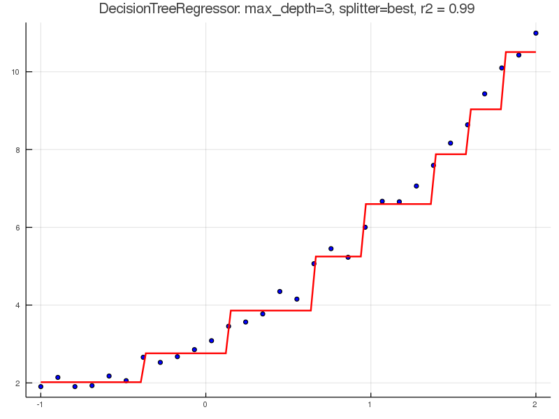
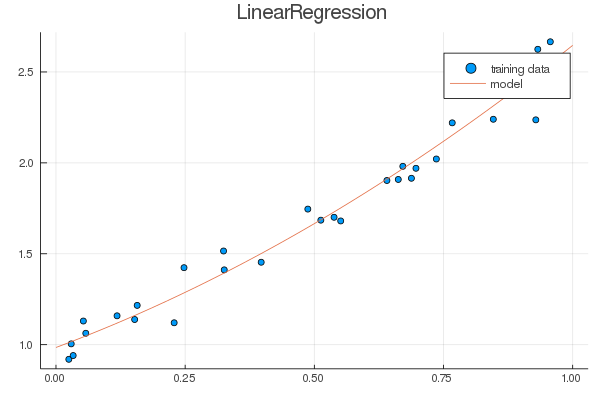

# MeLOne

**M**achin**e** **L**earning **One** - A package with simple implementation of Machine Learning models, made live on [twitch](https://twitch.tv/abelsiqueira).

## Methods

We have implemented a simple version of the following methods:

*Regression*:
- DecisionTreeRegressor
- LinearRegression
- KNNRegressor

*Classification*:
- DecisionTreeClassifier
- KNNClassifier
- LogisticRegression
- RandomForest

## API

Our objective is that all our methods implement the following API:

- `model = Model()`
- `fit!(model, X, y)`
- `y_pred = predict(model, X)`

In addition, some models will implement

- `pred_matrix = predict_proba(model, X)`

## Examples

